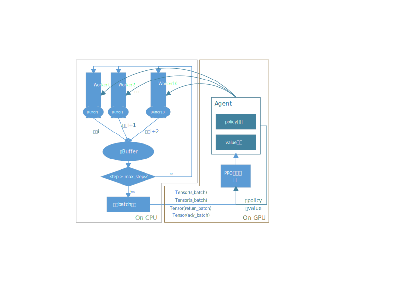
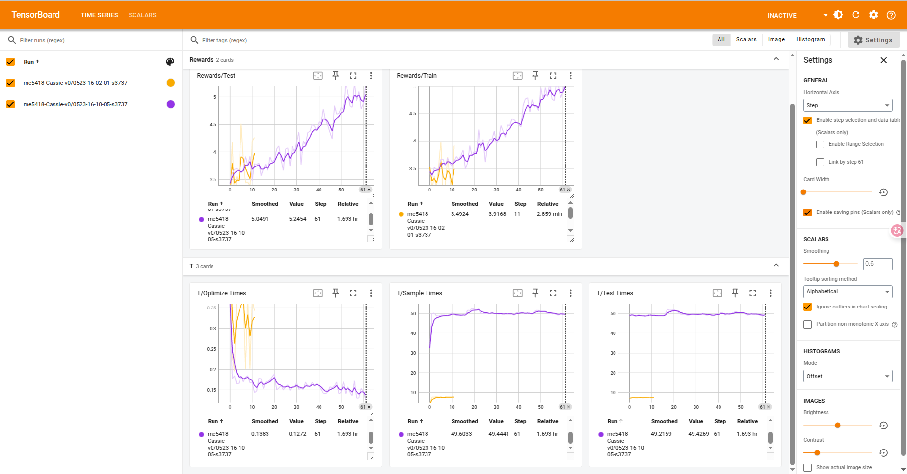

# CassieGymRL: PPO is All You Need
## 1 What we have

- Cassie OpenAI Gym environment*[1]
    - Gait cycle-based reward function design for gait locomotion
- Scalable 2-layer LSTM network of policy function
- Ray-based multi-process sample on CPU
- PPO loss-based agent upgrade*[2] on GPU
- An Intuitive Tensorboard-based training process demonstration

The framework of CassieGymRL: PPO is All You Need is shown below:



## 2 How to use

2.1 Installation

1) Environment

You must install the following environment:

`Ubuntu20.04`, `Python 3.9`, `Pytorch 2.40`, `MUJOCO2.0.0`


2) Install gym=0.21

```
$conda install -c conda-forge gym=0.21.0
```


2.2 Usage

First, then activate the conda environment, run the `train.py` to train the robot agent model, e.g.,

```
$ python train.py --num_steps 2000 --entropy_coeff 0.001 --max_traj_len 100 \
--lr_a 1e-3 --lr_c 1e-3 --hidden_width 256 --num_procs 2 --minibatch_size 20 
```

Second, run the following command to check the training process.

```
$ tensorboard --logdir=/home/.../This_Project_Dir/trained_models/ppo

# Note: Copying the full path would be recommended
```



Third, run `eval.py` directly, and a video will show out with `Total reward` displaying in the terminal.

E.g.,

```
python eval.py --exp_id 0524-16-20-23-s42

# Note:
# 1. If output "Segmentation fault (core dumped)", it is normal, try to run the command again.
# 2. The exp_id is set defaultly as your latest one.
```


## 3 One more thing

The authors would like to express heartfelt thanks to Prof. Guillaume Adrien Sartoretti@NUS, for his invaluable guidance. The author also thanks his teammates Duhy and Guozc for their fundamental works. The author also would like to feel grateful for so many companies hiring RL engineering in my home country. Now I am still open-hiring, please contact maij@u.nus.edu if you are willing to offer an opportunity.


## Reference
*[1] Adapted from https://github.com/osudrl/cassie-mujoco-sim, https://github.com/lbermillo/cassie-curriculum-learning/ and https://github.com/XHN-1/Cassie_mujoco_RL.*

*[2] Adapted from https://github.com/Lizhi-sjtu/DRL-code-pytorch.*


---

Appendice A: Gait Cycle Reward Design (in Gym)


